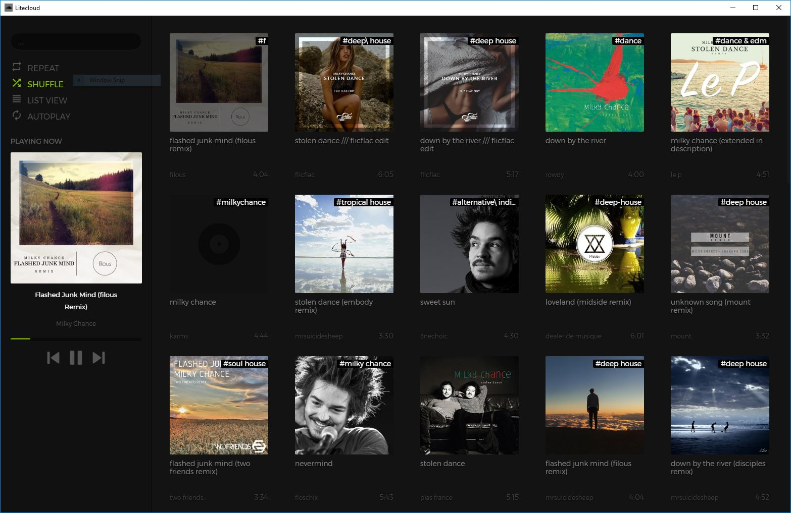
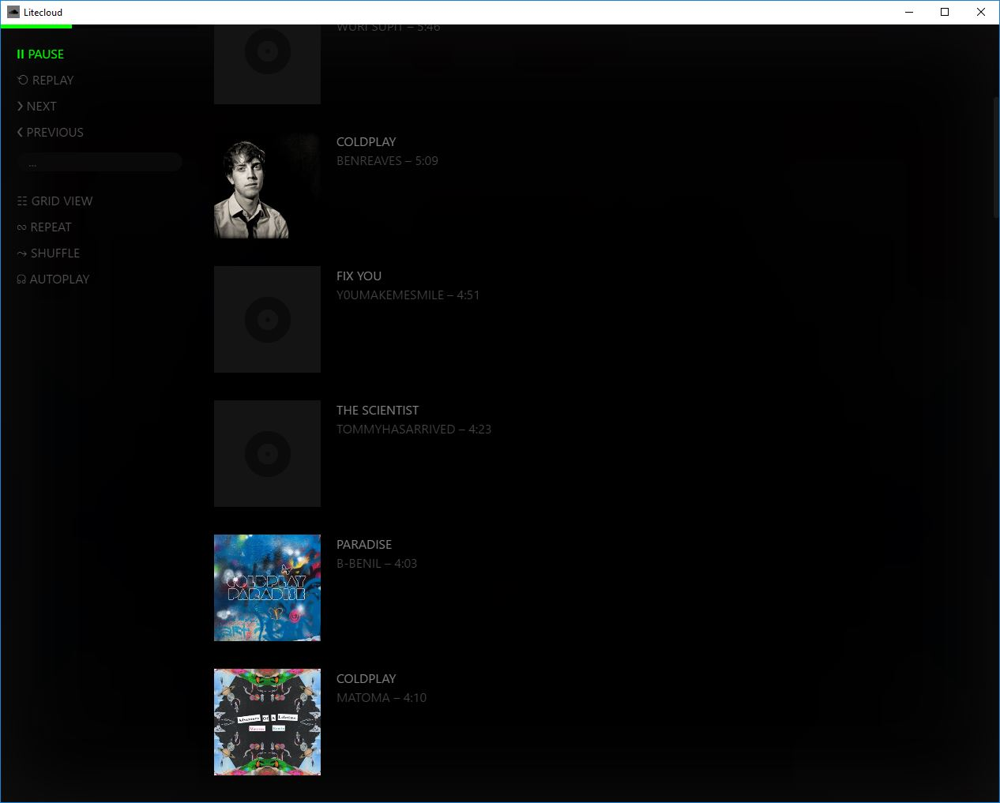

## Prerequisites
* `git clone https://github.com/adi518/litecloud.git`

## Run
Hit `run-all.vbs` to compile SCSS & view @ localhost:8000. Alternatively, you can use `live-preview`, such as in [Brackets](http://brackets.io/).

## Support
Please [open an issue](https://github.com/adi518/litecloud/issues) for support.

## Development & Contributing
* [Node.js](https://nodejs.org/en/) (```Stable```)

## Preview



