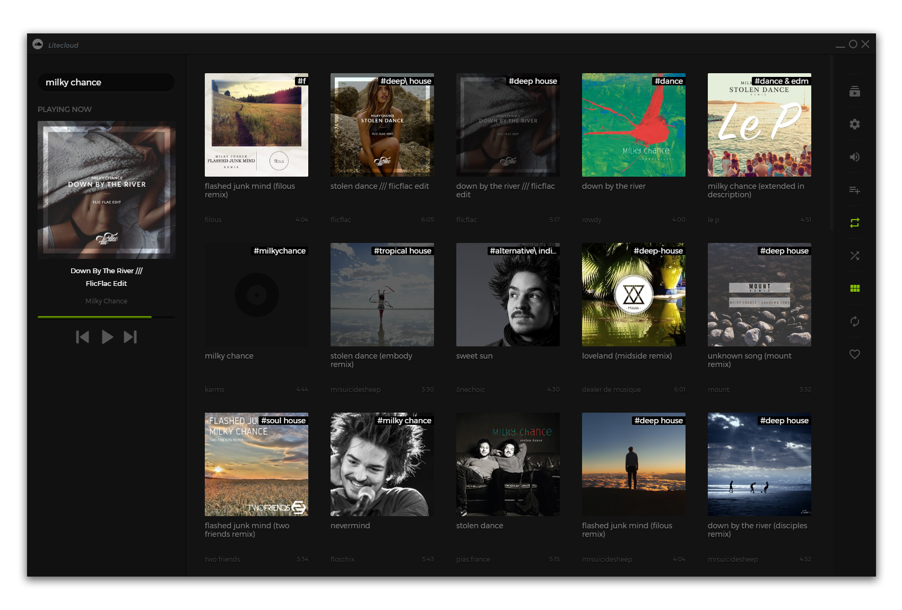

# Litecloud
Litecloud is a Soundcloud container integrating the Soundcloud API using React, Electron & Node.js.

## Prologue
This project currently serves as a learning curve for various technologies, some of which are yet implemented.

## Prerequisites
`git clone https://github.com/adi518/litecloud.git`

## Install
`npm run install`

## Development
`npm start` or `npm run start-offline` to start in offline mode (no requests will be made to Soundcloud API).

## Support
Please [open an issue](https://github.com/adi518/litecloud/issues) for support.

## Preview

